# 🛍️ WallaShop: AI-Powered Marketplace


## 📋 Descripción del proyecto
**WallaShop** es una plataforma web de compra-venta de segunda mano que automatiza la creación de anuncios mediante Inteligencia Artificial.  
El usuario solo necesita subir una imagen del producto, y la IA extrae automáticamente:

- 🏷️ Título  
- 📝 Descripción
- 📦 Estado  
- 🏭 Marca  
- 💻 Modelo  
- 🛠️ Daños o defectos  

Además, el sistema detecta **errores de calidad en la foto**, como desenfoque o dedos obstruyendo el producto.

---

## 🧱 Arquitectura Híbrida

El sistema utiliza una arquitectura de microservicios para separar la lógica de negocio del procesamiento de IA:

### 🔹 1. Aplicación principal — *Ruby on Rails* *Backend & Frontend*
- Gestión de usuarios (Autenticación y Autorización).
- CRUD completo de anuncios.
- Gestión de archivos multimedia con **Active Storage**.
- Se encarga de la comunicación con el microservicio.

### 🔹 2. Microservicio IA — *Python + Flask* *API de Procesamiento de Imágenes*
- Recepción y pre-procesamiento de imágenes.
- Construcción de prompts estructurados con **LangChain**.
- Comunicación con **OpenAI (GPT-4 Vision)**.
- Validación estricta de datos de salida con **Pydantic**.

---

# 🚀 Cómo funciona: Auto-Tagging con IA

El proceso reduce el tiempo de publicación a **solo un clic**:

1.  **Interceptación:** El usuario sube una imagen; Rails la captura mediante Active Storage.
2.  **Comunicación:** Rails envía la imagen en bruto al microservicio Flask (puerto 5000).
3.  **Análisis:** Python convierte la imagen a Base64 y la envía a OpenAI Vision.
4.  **Extracción:** La IA analiza la imagen y genera un JSON con los metadatos del producto.
5.  **Validación:** Si la foto es de mala calidad (desenfocada/obstruida), el sistema devuelve un error específico.
6.  **Autocompletado:** Si todo es correcto, Rails rellena el formulario automáticamente para el usuario.

---

# 🛠️ Tech Stack

| Componente | Tecnología | Uso Principal |
|-----------|------------|-------------|
| **Web Framework** | Ruby on Rails | Lógica de negocio y Vistas |
| **AI Service** | Python + Flask | API Rest para IA |
| **LLM / Vision** | OpenAI GPT-4 | Motor de inteligencia |
| **Orquestación IA**| LangChain | Gestión de Prompts |
| **Base de Datos** | SQLite | Persistencia de datos |
| **Estilos** | CSS / Bootstrap | Diseño Responsive |

---

# 🧩 Estructura del Proyecto

```text
TiendaIA (Rails App)
├── app
│   ├── controllers   # Controladores
│   ├── models        # Modelos
│   ├── views         # Vistas
│   └── storage       # Almacenamiento local de imágenes
├── config            # Configuraciones de entorno y rutas
├── db                # Esquema y Semillas
├── Dockerfile        # Configuración para despliegue en contenedor
└── Gemfile           # Definición de dependencias Ruby (gemas)

API_Reconocimiento (Microservicio Python)
├── API_IA.py         # Flask API
└── PruebaSolicitud   # Probar API 

```

---

# 🗄️ Base de Datos & Modelos

El sistema utiliza una base de datos relacional SQLite en desarrollo, siguiendo estrictamente la arquitectura Active Record de Rails. El diseño se centra en dos modelos principales (Usuario y Anuncio) y aprovecha la potencia de Active Storage para la gestión de archivos multimedia. 

🖼 Active Storage

Usa las tablas generadas automáticamente:

-active_storage_attachments

-active_storage_blobs

-active_storage_variant_records

## Esquema de Base de Datos

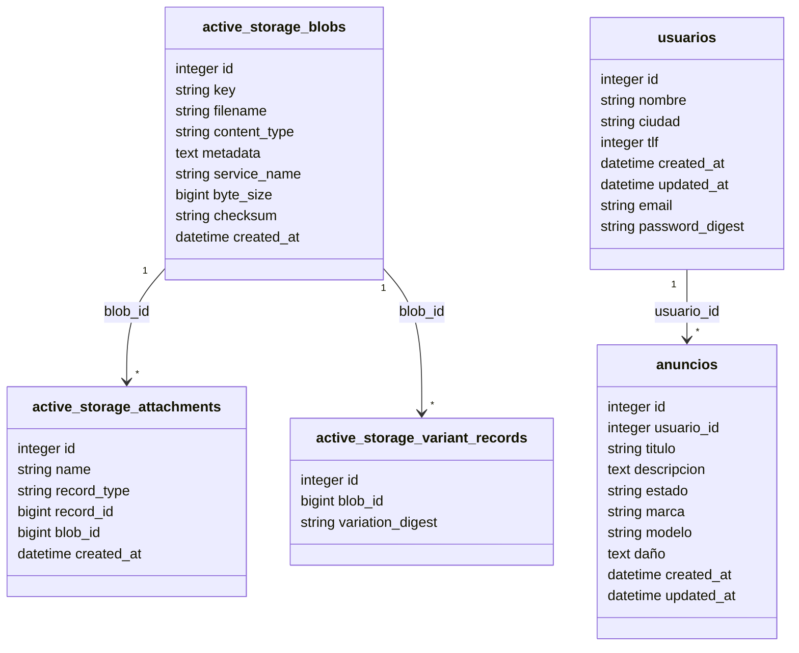
# ✨ Funcionalidades Clave

## 👤 Gestión de Usuarios

- 🔐 **Registro seguro**
- 🔑 **Login personalizado**
- 🔒 **Cifrado con `has_secure_password`**
- 📝 **Edición y eliminación de perfil**
- 👀 **Usuarios no registrados → solo lectura**
- 🧑‍💻 **Usuarios registrados → CRUD completo de anuncios**

---

# 🤖 Microservicio IA (Flask)

### ✔️ Auto-completado inteligente

Completa automáticamente:

- 🏷️ título  
- 📝 descripción  
- 📦 estado
- 🏭 marca
- 💻 modelo   
- 🛠️ daños  

### ✔️ Validaciones automáticas de calidad de imagen

- ❌ Desenfoque  
- ❌ Dedos cubriendo cámara  
- ❌ Formatos no válidos  
- ✔️ Manejo de errores devueltos por Flask

## 🧠 Funcionamiento del Microservicio

Flujo completo:

1. Recibe la imagen
2. Convierte a base64
3. Construye prompt con LangChain
4. Llama al modelo OpenAI
5. Valida con Pydantic
6. Devuelve JSON a Rails

---

## 🔗 Integración Rails → Flask

### 📡 Código que ejecuta la llamada

```ruby
uri = URI.parse('http://localhost:5000/analyze_image')
http = Net::HTTP.new(uri.host, uri.port)

request = Net::HTTP::Post.new(uri.request_uri)
form_data = [['image', image.tempfile]]

request.set_form form_data, 'multipart/form-data'
response = http.request(request)

JSON.parse(response.body)

```

---
🧪 Depuración

Usa byebug para inspección profunda:

```ruby
byebug
# n = next
# s = step
# c = continue
```

---

# 📸 Interfaz de Usuario

## 🔹 Cabecera + Pie


---

## 🔹 Portada
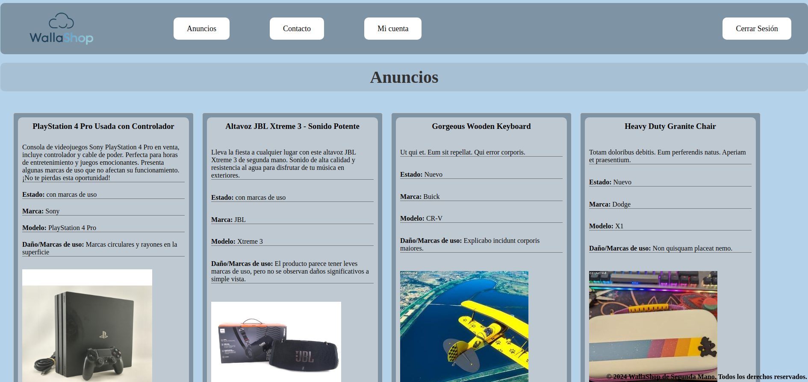

---

## 🔹 Registro + Error de registro


---

## 🔹 Iniciar sesión + Errores
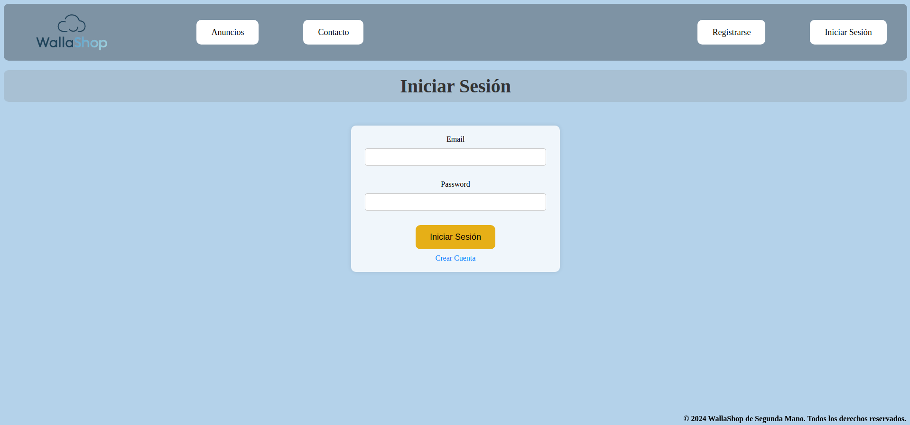
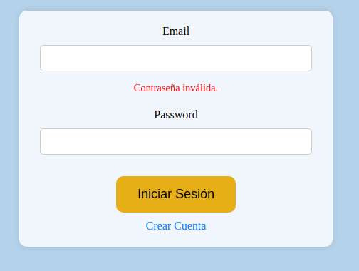
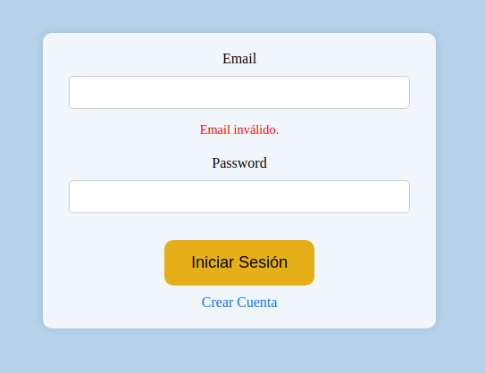
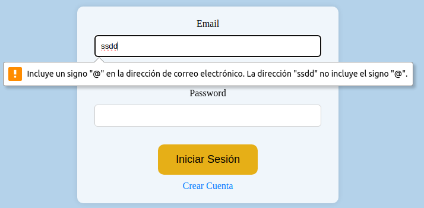

---

## 🔹 Perfil "Mi Cuenta"
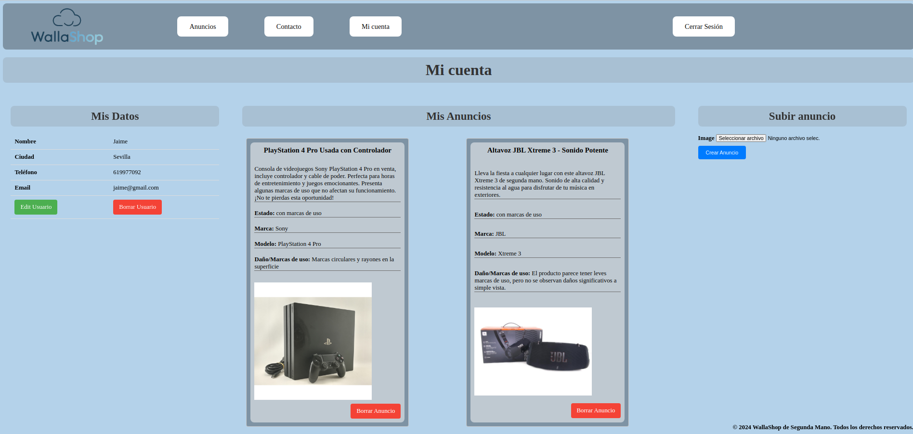

---

## 🔹 Primera Columna
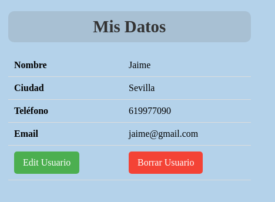

---

## 🔹 Editar Usuario + Error
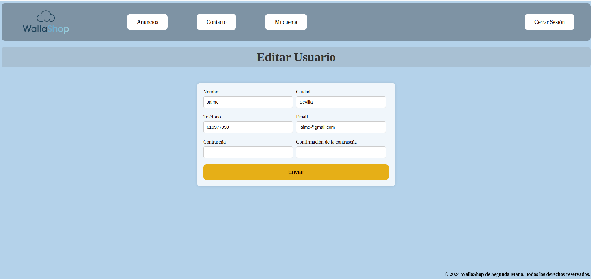
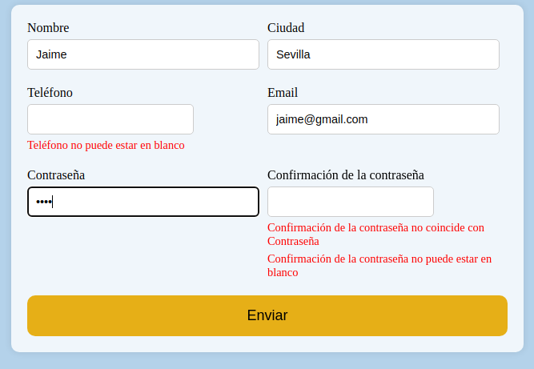

---

## 🔹 Segunda Columna


---

## 🔹 Tercera Columna
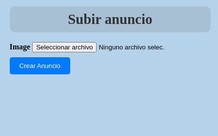

---

## 🔹 Mensajes de alerta en la web
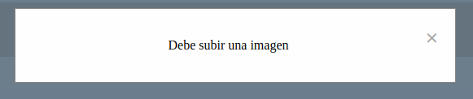
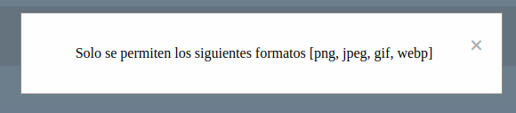
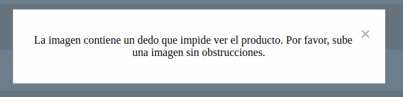
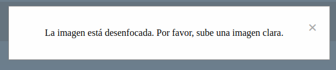
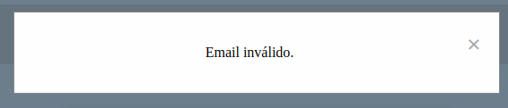
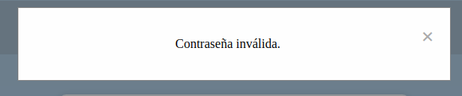
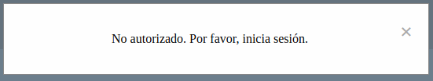


---

## 🔹 Mensajes de noticia
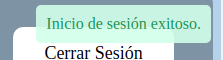
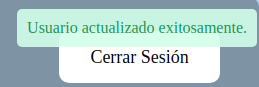
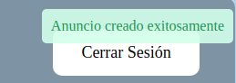
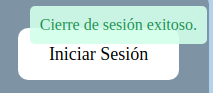
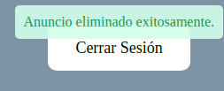
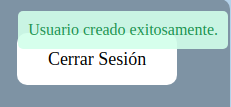

---

## Usuario no registrado
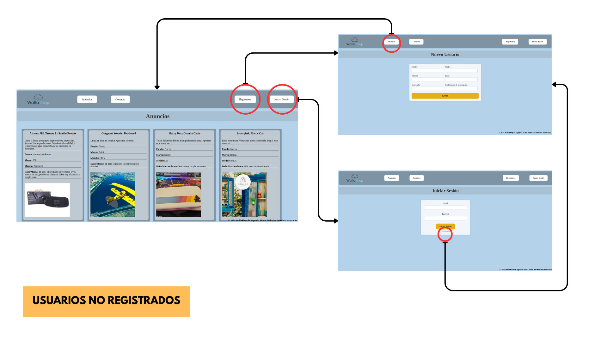

---

## Usuario registrado
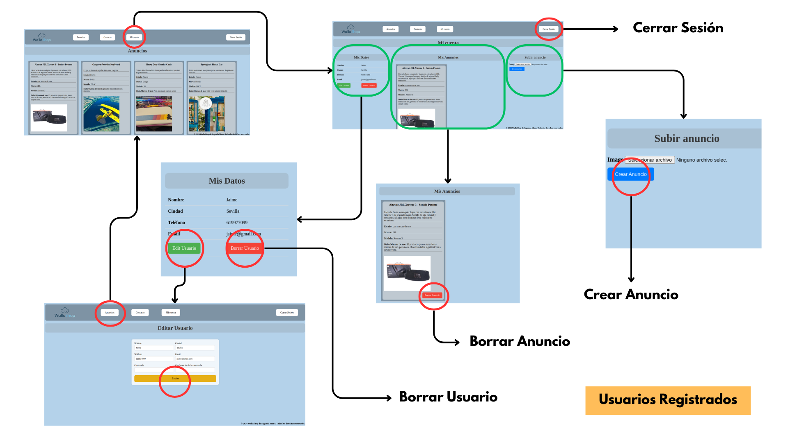

---

# 👨‍💻 Autor

**santibachibc** - Proyecto Integrado DAW 2024  
---
Hecho con ❤️, 💎 (Ruby) y 🐍 (Python).


